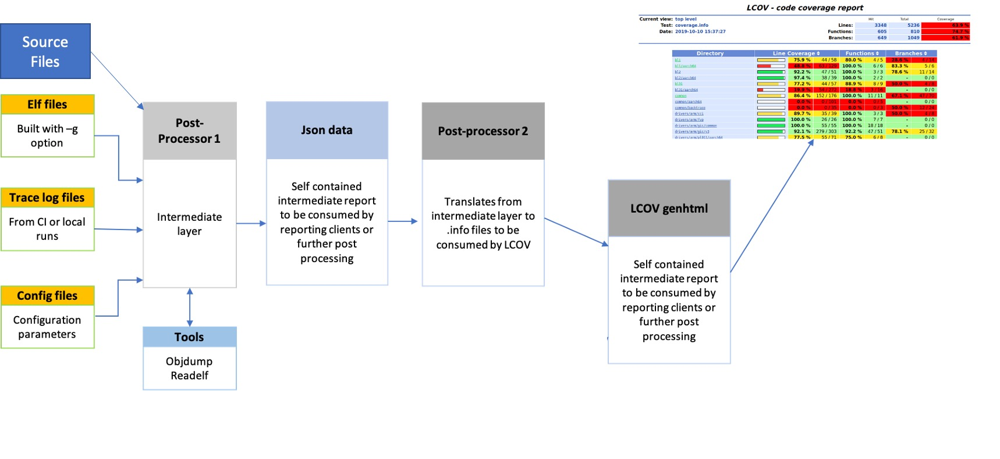

# Design overview

This document explains the overall design approach to the trace-based code coverage tool.

## Motivation

The primary motivation for this code coverage tool is driven by the fact that there are no commercial off-the-shelf (COTS) tools that can be readily used for doing code coverage measurement for firmware components - especially those meant for memory constraint platforms. Most of the tools rely on the traditional approach where the code is instrumented to enable the coverage measurement. In the case of  firmware components designed for memory constraint platforms, code size is a key consideration and the need to change memory maps to accomodate the instrumented code for enabling coverage measurement is seen as a pain point. A possible alternative is to perform the coverage measurement on emulation platforms which could free up the constraints of memory limitations. However this adds the need to have more platform specific code to be supported in the firmware for the emulation platform.

The above factors led to a design approach to measure the code coverage based on execution trace, without the need for any code instrumentation. This approach provides the following benefits:
- allows the user to test the real software stack without worrying about memory constraints - no code is instrumented; meaning real software is used during coverage run.
- allows the user to test on real platforms rather than partial system emulations - coverage information can be obtained without expensive modelling or porting effort.


## Known Limitations

The following limitations are understood to exist with the trace-based coverage tool

- This works only with non-relocatable code: here we can easily map the execution address of an instruction to those determined from the generated binaries. Even if there is some position independent code involved, if the location binding happens at build time then also the user can use this tool as the post-processing stage could still be made to do the mapping.
- Accuracy of code coverage info mapped to the source code is limited by the completeness of DWARF signatures embedded: we know that with higher levels of code optimisation the DWARF signatures embedded will be `sparse` in nature, especially when the generated code is optimised for size. Ideally this solution works best when there is no compiler optimisation turned ON.
- This is currently proven to work on FVPs (Fixed Virtual Platforms): Early prototyping shows this approach can work with Silicon platforms, however needs further development.


## Design Details
The following diagram outlines the individual components involved in the trace-based coverage tool.



The following changes are needed at each of the stages to enable this code coverage measurement tool to work.

### Compilation stage

The coverage tool relies on the DWARF signatures embedded within the binaries generated for the firmware that runs as part of the coverage run. In case of GCC toolchain we enable it by adding -g flag during the compilation.

The -g flag generates DWARF signatures embedded within the binaries as see in the example below:
```
100005b0 <tfm_plat_get_rotpk_hash>:
tfm_plat_get_rotpk_hash():
/workspace/workspace/tf-m-build-config/trusted-firmware-m/platform/ext/common/template/crypto_keys.c:173
100005b0:	b510	push	{r4, lr}
/workspace/workspace/tf-m-build-config/trusted-firmware-m/platform/ext/common/template/crypto_keys.c:174
100005b2:	6814	ldr	r4, [r2, #0]
```

### Trace generation stage

The coverage tool relies on the generation of the execution trace from the target platform (in our case FVP). It relies on the coverage trace plugin which is an MTI based custom plugin that registers for trace source type `INST` and dumps a filtered set of instruction data that got executed during the coverage run. In case of silicon platforms it expects to use trace capture with tools like DSTREAM-ST.

See [Coverage Plugin](./plugin_design.md) documentation to know more about this custom plugin.

The following diagram shows an example trace capture output from the coverage trace plugin:
```
[PC address, times executed, opcode size]
0010065c 1 4
00100660 1 4
00100664 1 2
00100666 1 2
...
```

### Post-processing stage

In this stage coverage information is generated by:
1. Determining the instructions executed from the trace output captured.
2. Mapping those instructions to source code by utilising the DWARF signatures embedded within the binaries.
3. Generating the LCOV .info files allowing us to report the coverage information with the LCOV tool and merge reports from multiple runs.

### Typical steps to integrate trace-based coverage tool to CI setup

- Generate the DWARF binary (elf or axf) files at build stage using the -g flag or equivalent compiler switches.
- Build the coverage plugin using the corresponding PVLIB_HOME library for the 64-bit compiler and deploy in your CI to be used during execution.
- Use the coverage plugin during FVP execution by providing the additional parameters. See [here](./plugin_user_guide.md#capturing-a-trace)
- Clone the sources in your local workspace if not already there.
- The generated trace logs along with the DWARF binary files, the bin utilities (objdump, readelf from the same toolchain for the  DWARF binary files) and source code will be used as input to the *intermediate_layer.py* to generate the intermediate json layer.
- The *generate_info_file.py* will parse the json intermediate layer file to an info file that can be read by the genhtml binary from LCOV.
- Optionally use the merge.py to merge multiple coverage info files to generate a combined report.
## License
[BSD-3-Clause](../../license.md)

